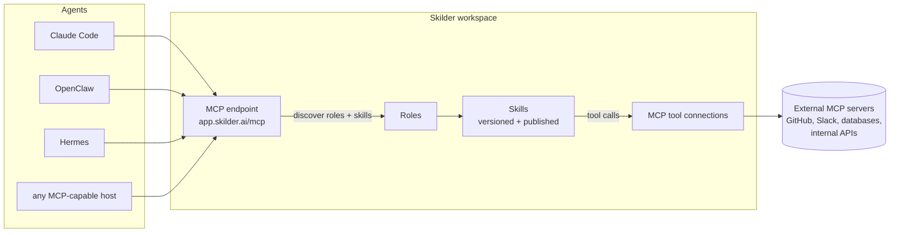

# Skilder Skills

[Skilder](https://skilder.ai) runs the lifecycle behind a team's skills and MCP tools: versioning, publish and rollback, per-skill usage measurement, and distribution to every connected agent from a single MCP endpoint.

Every skill in this repo uses the open [Agent Skills](https://agentskills.io) format: a folder with a `SKILL.md` plus optional reference files, portable across any compliant agent.

## The skills

| Skill | What it does |
|---|---|
| [`connect-to-skilder`](skills/connect-to-skilder) | One-shot instruction that makes an agent connect itself to Skilder over MCP (OAuth, zero config). Paste it into any agent chat once. |
| [`import-skills-to-skilder`](skills/import-skills-to-skilder) | Scan the Agent Skills already on this machine or repo and import them into your Skilder workspace, as-is, so every connected agent on the team can run them. |

A typical first run chains them: paste `connect-to-skilder` into an agent chat, the agent registers `https://app.skilder.ai/mcp` and completes OAuth in your browser, then `import-skills-to-skilder` moves the skills already on that machine into the workspace, where the rest of the team's agents can discover and run them.

## Get the skills

Pick the channel your agent already uses. All of them deliver the same skill folders.

| Channel | Command |
|---|---|
| [skills.sh](https://skills.sh) (cross-agent) | `npx skills add skilder-ai/skills` |
| [ClawHub](https://clawhub.ai) (OpenClaw) | `clawhub install connect-to-skilder` |
| Hermes Agent (tap) | `hermes skills tap add skilder-ai/skills` |
| Manual | Copy a folder from [`skills/`](skills) into your agent's skills directory, e.g. `.claude/skills/` or `~/.claude/skills/` |

On ClawHub both skills are published under the [`@skilder`](https://clawhub.ai) publisher: `connect-to-skilder` and `import-skills-to-skilder`.

## Prefer to connect by hand?

`connect-to-skilder` exists so an agent can run this step itself, and so you can hand the connect step to teammates as a file. The manual equivalent is one entry in your client. Either path ends at the same place: the first call to the server opens a browser OAuth sign-in.

```bash
# Claude Code
claude mcp add skilder-ai --transport http https://app.skilder.ai/mcp

# Codex
codex mcp add skilder-ai --url https://app.skilder.ai/mcp
```

Clients configured through a JSON file take the same entry. Cursor (`~/.cursor/mcp.json`) and most other hosts nest it under `mcpServers`:

```json
{
  "mcpServers": {
    "skilder-ai": {
      "type": "http",
      "url": "https://app.skilder.ai/mcp"
    }
  }
}
```

VS Code (`.vscode/mcp.json`) uses `servers` as the top-level key with the same entry:

```json
{
  "servers": {
    "skilder-ai": {
      "type": "http",
      "url": "https://app.skilder.ai/mcp"
    }
  }
}
```

Any other MCP-capable host: point it at `https://app.skilder.ai/mcp` with the streamable-http transport.

## How it fits together



1. An agent connects once to `https://app.skilder.ai/mcp` over Streamable HTTP and signs in with OAuth, either by running `connect-to-skilder` or via the [manual one-liners](#prefer-to-connect-by-hand).
2. `init_skilder` returns the workspace catalog: the Roles an agent can take on and the Skills behind them.
3. The agent loads a skill's instructions on demand, at the moment a task calls for it.
4. When a skill uses a tool, Skilder routes the call to the connected MCP server, applies workspace permissions, and records the run per skill and session for measurement and audit.

## Why route this through Skilder

- **One endpoint instead of per-agent config.** Connect each agent once; every skill and tool the workspace publishes after that reaches it without touching the agent again.
- **A release cycle for skills.** Draft, publish, and roll back skill versions centrally; agents always resolve the published version.
- **Usage you can inspect.** Every skill run and tool call is attributed to a skill, session, and workspace, so you can see what your agents actually use.
- **Portability both ways.** Skills enter and leave in the open Agent Skills format; existing skill folders import verbatim, and anything in the workspace stays exportable.

Docs: [docs.skilder.ai](https://docs.skilder.ai) · Support: contact@skilder.ai

## License

MIT
