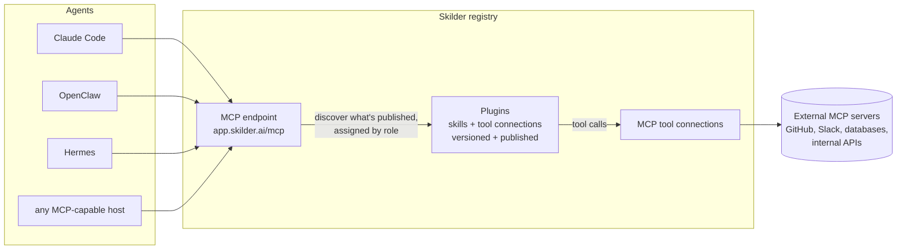

# Skilder - Lifecycle management for Agent Plugins

[](https://skills.sh/skilder-ai/skills)

```bash
npx skills add skilder-ai/skills
```

One command installs both skills below into your agent, straight from [skills.sh](https://skills.sh/skilder-ai/skills). Then ask your agent to connect to Skilder and it takes care of the rest.

## The problem this solves

The industry just aligned on how to package agent capabilities: the [Agent Plugins](https://agent-plugins.org) standard bundles [Agent Skills](https://agentskills.io) and MCP server configurations into one portable format. Build once, load into any compliant client.

The standard is deliberately minimal. It defines the package and leaves the rest out of scope: distribution, updates, permissions, telemetry, deprecation. The moment plugins are shared across a machine, a team, or a company, that entire lifecycle becomes your problem.

[Skilder](https://skilder.ai) is that layer. Plugins live in a graph registry as governed units, composed of skills and MCP tool connections, with their own lifecycle: versioned, published, rolled back independently of any agent or model. Distribution is just in time: an agent connects once to its MCP endpoint, discovers what's published for it, and loads a capability at the moment a task calls for it.

The spec defines the package. Skilder runs it.

**What you gain:**

- **No more tool context bloat.** Agents see a catalog and pull a plugin's full instructions only when a task needs them, instead of preloading every tool definition.
- **No orchestration token overhead.** Multi-step work can run as scripts inside Skilder, chaining tools server-side instead of round-tripping every call through the model.
- **One version of truth, instantly updated.** Publish a change once; every connected agent resolves the same published version from its next session.
- **Built-in permissions.** Tool calls execute through Skilder under team permissions, with credentials held centrally; an agent never carries a secret.
- **Execution where your data lives.** Tool calls run through Skilder runtimes deployed where you choose: our cloud, your VPC, on-prem, or a developer machine. Internal systems stay internal; the agent only ever talks to the endpoint.
- **Metrics at plugin, skill and tool level.** Every run is recorded per skill, tool, and session, so usage is measurable instead of invisible.

Every skill in this repo uses the open [Agent Skills](https://agentskills.io) format, the same building block the Agent Plugins standard packages: a folder with a `SKILL.md` plus optional reference files, portable across any compliant agent.

## The skills

| Skill | What it does |
|---|---|
| [`connect-to-skilder`](skills/connect-to-skilder) | One-shot instruction that makes an agent connect itself to Skilder over MCP (OAuth, zero config). Paste it into any agent chat once. |
| [`import-skills-to-skilder`](skills/import-skills-to-skilder) | Scan the Agent Skills already on this machine or repo and import them into your Skilder workspace, as-is, so every connected agent on the team can run them. |

A typical first run chains them: paste `connect-to-skilder` into an agent chat, the agent registers `https://app.skilder.ai/mcp` and completes OAuth in your browser, then `import-skills-to-skilder` moves the skills already on that machine into the workspace, where the rest of the team's agents can discover and run them.

## Get the skills

Pick the channel your agent already uses. All of them deliver the same skill folders.

| Channel | Command |
|---|---|
| [skills.sh](https://skills.sh) (cross-agent) | `npx skills add skilder-ai/skills` |
| [ClawHub](https://clawhub.ai) (OpenClaw) | `clawhub install connect-to-skilder` |
| Hermes Agent (tap) | `hermes skills tap add skilder-ai/skills` |
| Manual | Copy a folder from [`skills/`](skills) into your agent's skills directory, e.g. `.claude/skills/` or `~/.claude/skills/` |

On ClawHub both skills are published under the [`@skilder`](https://clawhub.ai) publisher: `connect-to-skilder` and `import-skills-to-skilder`.

## Prefer to connect by hand?

`connect-to-skilder` exists so an agent can run this step itself, and so you can hand the connect step to teammates as a file. The manual equivalent is one entry in your client. Either path ends at the same place: the first call to the server opens a browser OAuth sign-in.

```bash
# Claude Code
claude mcp add skilder-ai --transport http https://app.skilder.ai/mcp

# Codex
codex mcp add skilder-ai --url https://app.skilder.ai/mcp
```

Clients configured through a JSON file take the same entry. Cursor (`~/.cursor/mcp.json`) and most other hosts nest it under `mcpServers`:

```json
{
  "mcpServers": {
    "skilder-ai": {
      "type": "http",
      "url": "https://app.skilder.ai/mcp"
    }
  }
}
```

VS Code (`.vscode/mcp.json`) uses `servers` as the top-level key with the same entry:

```json
{
  "servers": {
    "skilder-ai": {
      "type": "http",
      "url": "https://app.skilder.ai/mcp"
    }
  }
}
```

Any other MCP-capable host: point it at `https://app.skilder.ai/mcp` with the streamable-http transport.

## How it fits together



1. An agent connects once to `https://app.skilder.ai/mcp` over Streamable HTTP and signs in with OAuth, either by running `connect-to-skilder` or via the [manual one-liners](#prefer-to-connect-by-hand).
2. `init_skilder` returns the workspace catalog: the plugins published for this agent, grouped by role, the job function an agent takes on, like "Sales Rep" or "Support".
3. The agent loads a skill's instructions on demand, at the moment a task calls for it.
4. When a skill uses a tool, Skilder routes the call to the connected MCP server, applies workspace permissions, and records the run per skill and session for measurement and audit.

Docs: [docs.skilder.ai](https://docs.skilder.ai) · Support: hello@skilder.ai

## License

MIT
